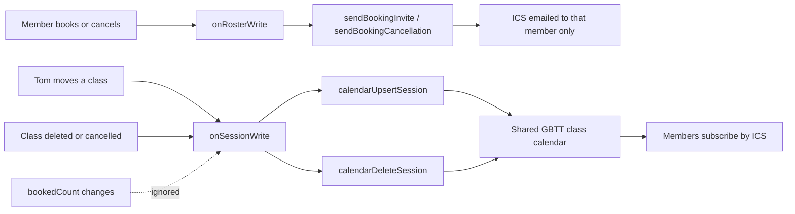

# Integrations

## Production stack

- **Marketing site** (`src/`) — homepage, contact form, public timetable
- **Member & trainer apps** (`apps/`) — booking, admin, role-call, billing
- **Firestore** — system of record (see `firestore.rules`)
- **Firebase Auth** — members, admin, trainers (email/password or Google)
- **Cloud Functions** (`functions/`) — account creation, billing, calendar webhooks
- **Apps Script** (`google-apps-script/Code.gs`) — email + Google Calendar on Tom's account

Configure secrets per [`docs/secrets-setup.md`](secrets-setup.md).

## Contact form

Posts to Apps Script when `VITE_FORM_ENDPOINT` is configured; otherwise mailto fallback.

## Google Calendar

Attendance counts are **not** synced to Google Calendar. They change all day, the website already
shows them live from Firestore, and pushing them would burn Apps Script quota and email guests
repeatedly. Calendar carries two things only, each on its own trigger:

**Per-member bookings.** `onRosterWrite` fires only when a roster entry is created or deleted, and
emails that member a `text/calendar` attachment: `METHOD:REQUEST` on booking, `METHOD:CANCEL` on
cancellation. The UID is an MD5 of `sessionId|memberEmail`, so the cancellation updates the same
event the invite created instead of leaving a duplicate. Role-call edits (`booked` to `attended`)
change an existing document, so they send nothing.

Members are deliberately **not** added as guests on the shared event. Guest lists are visible to
every other guest, which would leak the roster and override each member's
`showNameToClassmates` preference, and editing a guest-bearing event emails everyone on it.

**Shared class calendar.** `onSessionWrite` updates it only when a schedule field actually changes
(`weekStart`, `dayLabel`, `time`, `classTypeId`, `className`, `instructorId`, `venue`,
`durationMinutes`, `cancelled`). A write that only bumps `bookedCount` is ignored — that guard is
what keeps the calendar quiet.

The event id returned by the upsert is stored back on the session as `calendarEventId`, so a later
move or removal addresses that event directly. Sessions written before that was kept are matched by
searching the week for their `sessionId`, which is why the description carries it.

**Removing a class.** Both ways of taking a class off the timetable delete its calendar event, so a
subscriber is never left with an entry for a session nobody can attend:

- the session document is **deleted** when nobody had booked;
- it is flagged **`cancelled`** when a roster had to be kept for attendance and billing.

The delete fires on the transition into `cancelled` only, so re-saving an already-cancelled session
does not spend a call removing an event that has already gone. Un-cancelling recreates the event,
because `cancelled` is itself a schedule field.

**Member subscriptions.** `getCalendarSubscribeUrl` is callable by any signed-in account and returns
the calendar's Google and ICS addresses, which the member app offers under “Add the timetable to
your calendar”. The result is cached in `meta/calendarSubscribe` for a day, and a stale cache is
served in preference to an error. These are Google's *public* calendar URLs, so **the calendar must
be shared publicly** ("Make available to public" in its Google Calendar settings) before they
resolve for anyone but Tom.

Nothing is ever read back from Google Calendar. Firestore is the source of truth and pushes live
counts to the site; Calendar is a downstream mirror for personal diaries.

## Local development without Firebase

Apps show a configuration banner when `VITE_FIREBASE_*` env vars are missing. Studio data uses browser `localStorage` until Firestore is connected.
